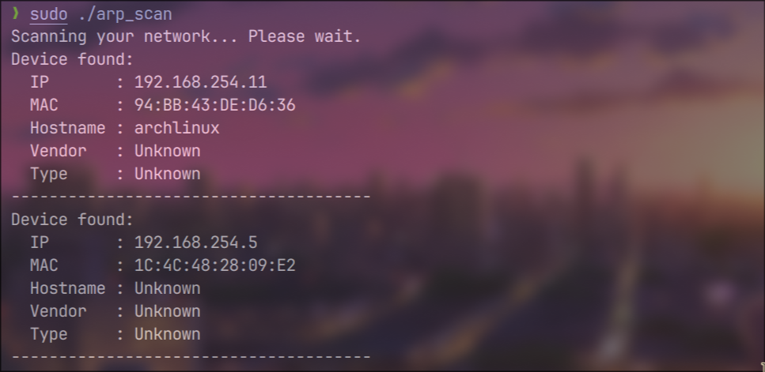

# lab_monitor

A local network monitoring tool for educational lab environments.

## Features
- Captures DNS traffic
- Logs visited domains per IP
- Helps monitor web usage in computer labs

## Files
- sniffer.cpp: Uses libpcap to sniff packets
- dns_parser.cpp: Parses DNS packets for domain names
- log_writer.cpp: Logs domain access per user/IP

## 📸 Screenshot

---

## Usage
Compile with g++ and ensure libpcap is installed.
